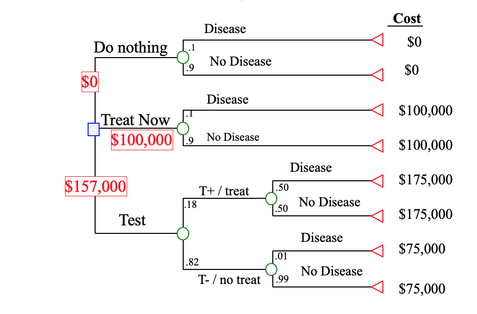

## Why models? 

What does it mean to make good decisions using models?  

---

## What is a model? 

A model is a mathematical relationship that comes with a story.  @stokey1978primer give a definition:

> "A model is a simplified representation of some aspect of the real world, sometimes of an object, sometimes of a situation or a process"

A good model reduces a complex situation to a set of essential mechanisms, or dynamics, that an analyst needs in order to make a good decision. 

A bad model mischaracterizes the mechanism of interest, is too simple to capture important dynamics, or is too complicated to be calibrated or understood. 


---

## Examples 

- Optimizing the HIV care pipeline
- Counting drug users and other risk groups
- Deciding whom to vaccinate against disease
- Stopping infectious disease outbreaks
- Optimizing hospital staffing

---

## Modeling and scientific hypotheses

Models formalize scientific hypotheses about the mechanism that produces a phenomenon of interest. 

When data agree with our model, then we may accumulate evidence that the model is correct, or at least that the data do not falsify the model. 

When we observe data that do not agree with the predictions of our model, then this might be evidence that our hypotheses are wrong.  

---

## Model fit to empirical data 

Observing that a model fits data well is not a sufficient condition to imply that the model is correct.  

What do we mean "correct"? We mean mechanistic or causal. This goes beyond fitting data well.  We mean that a model captures the mechanistic features of the data-generating process that are important for the decisions we want to make.  

All models are wrong, but some are useful.
-- George Box 


## Why are mechanistic models useful? 

A few explanations: 

- Intuitive: they formalize hypotheses
- Statistical: limit free parameters
- Curse of dimensionality 
- Interpretability
- Causal interpretation of counterfactual comparisons

---

## Why are mechanistic models sometimes dangerous? 

- Limit hypotheses to models that are easy to specify
- Inflexible structure limits fitting
- Sometimes you don't know when they are wrong, even when they fit data well
- More complicated reasons related to causal inference

---

## Statistical vs mechanistic models 

If you have taken a statistics class, you have seen statistical approaches to explaining variation.  For example, consider the "statistical regression model"
$$ y = \alpha + \beta x + \epsilon $$ 
If we regard $x$ as a treatment and $y$ as a health outcome for a given patient, then we would like to think of $\beta$  as the "effect" of the treatment.  

This model posits a linear relationship between treatment and outcome. Given a one-unit change in $x$, we expect the outcome $y$ to change by an increment of $\beta$. 

---

## My philosophy

I think there is _no difference_ between "statistical" and "mechanistic" models, except for the stories we tell about their structure and coefficients.  This suggests:

- We should strive to interpret statistical models in a mechanistic way, and reject them if they are deemed unrealistic in their structure.   
- We should treat mechanistic models as statistical models and fit them to data, whenever possible.  When not possible, we should ask what new data we ought to collect. 

---

## Prescriptive versus descriptive models 

?

---

## The importance of prediction in public health decision-making


---

## Principles of mechanistic thinking 

flow, mass action, density/frequency dependence

The role of causal inference: if I change this input, the effect will be thus

---


Agent-based models

networks
spatial models


---

## Shapes of functions

As we begin to construct models, let's think about the building blocks of mathematical relationships: functions and their shapes. 

As a brief review, we will go over the basic function types we will see in this course. 

---


### Straight lines

$$ f(x) = ax + b $$

```{r}
xs = seq(0,1,by=0.01)
plot(xs, -2 + 0.7*xs, type="l", xlab="x", ylab="f(x)", bty="n")
```

---


### Polynomials

A quadratic equation 

$$ f(x) = ax^2 + bx + c $$ 

A cubic equation 

$$ f(x) = ax^3 + bx^2 + cx + d $$

```{r}
xs = seq(-1,1,by=0.01)
plot(xs, -2 - 0.7*xs + xs^2, type="l", xlab="x", ylab="f(x)", bty="n")
lines(xs, -2 - 0.7*xs + xs^2 + xs^3, col="red")
abline(v=0, lty="dashed", col="gray")
abline(h=0, lty="dashed", col="gray")
```

---


### Exponential function 

The exponential function is the unique function $f(x)$ such that $f'(x)=f(x)$ for all $x$.  When we write $e$, it means the "natural number" $e\approx 2.71\ldots$. 

$$
f(x) = a e^{bx}
$$
This may also be written as 
$$
f(x) = a \exp(bx)
$$
when a and b are positive, $f(x) = a\exp(bx)$ grows quickly. Exponential growth happens when a quantity increases at a rate proportional to how big it already is.  More on this later. 

```{r}
xs = seq(-1,1,by=0.01)
plot(xs, exp(xs), xlab="x", type="l", ylab="f(x)", bty="n")
lines(xs, exp(-xs), col="red")
abline(h=0, lty="dashed", col="gray")
abline(v=0, lty="dashed", col="gray")
```

---

### Logarithmic function 

The inverse function of $\exp()$ is the natural logarithm
$$
f(x) = \log(x)
$$
That is, if $x$ is any real number and $y=\exp(x)$, then $x = \log(y)$

```{r}
xs = seq(0.01,2,by=0.01)
plot(xs, log(xs), xlab="x", type="l", ylab="f(x)=log(x)", bty="n")
abline(h=0, lty="dashed", col="gray")
```

---

### Logistic function 

Logistic growth happens when initially a quantity grows quickly (as in exponential growth), but then saturates, or plateaus as its argument gets large. 

$$ f(x) = \frac{e^{ax}}{1+e^{ax}} $$

An equivalent way to write this is 

$$ f(x) = \frac{1}{1+e^{-ax}} $$

The logistic transform is an easy way to take a quantity $x$ that can be positive or negative, and rescale it so that it is always between 0 and 1.  


```{r}
xs = seq(-3,3,by=0.01)
plot(xs, 1/(1+exp(-xs)), xlab="x", type="l", ylab="f(x)", bty="n")
abline(h=0, lty="dashed", col="gray")
```

---

### Sinusoidal functions

A useful class of sinusoidal functions is 
$$
f(x) = a + b\sin(c(x-d))
$$
where $a$ is the offset, $b$ is the amplitude, $c$ is the rate or frequency, $d$ is the phase shift. 

In this course, the argument to all sinusoidal functions will be in radians. 

```{r}
xs = seq(0,4*pi,by=0.01)
plot(xs, sin(xs), xlab="x", type="l", ylab="f(x)=sin(x)", bty="n")
abline(h=0, lty="dashed", col="gray")
```

---


## Types of model constructions

Ways of specifying relationships 

- flow-based
- decision trees
- stochastic and deterministic
- agent-based


---

## Conceptual flow-based

compartmental diagrams 

---

## Decision trees 

spend some time on this!  computing marginal and conditional probabilities on decision trees. 



---

stochastic and deterministic models


---

Agent-based models


---

# Modeling with rates

What is a rate? 

change over time 

difference equation interpretation of derivative 


The derivative of a differentiable function at $x$ is defined as 

$$ f'(x) = \lim_{h\to 0} \frac{f(x+h) - f(x)}{h} $$

Intuitively this means that the derivative of a function $f$ at the point $x$ is a measure of how quickly the function value changes near $x$. Equivalently it is the slope of the tangent line of $f(x)$ at $x$. Let's look at some derivatives: 

[shiny example of polynomial derivative at 0]

---

### Why characterize a process by its rates of change?

It is often easier to think about the dynamics of a process in terms of its rates of change.  It is very common that the solution to a system of differential equations is impossible to write down analytically, but very easy to characterize in terms of its rates of change.  

So, from a practical perspective, we can often just write the system in terms of its rates of change, and then use a computer to find the "solution" for the dynamics of the system.  

In general, the study of analytic solutions of ODEs is a domain of mathematics.  We are going to largely avoid analytical solutions and treat these systems as descriptions that can be solved using a computer.  We will see several examples next. 


---

## Example: A linear model for a treatment effect

Let $y$ be an indicator of 5-year survival in a clinical trial for a new cancer therapy.  Let $x\in\{0,1\}$ the treatment, where $x=1$ indicates receipt of a new chemotherapy, and $x=0$ standard of care.  We might model the survival outcome as a linear function of $x$:

$$ y = \alpha + \beta x + \epsilon $$ 

where $\epsilon$ is a random number that is zero on average.  This is a common statistical model, and people sometimes interpret $\beta$ as the _causal effect of treatment_. 


---

### Example: multiplication of bacteria 

Let $y(t)$ be the number of bacteria in a dish at time $t$.  Suppose at time $t=0$, there are $y(0) = y_0$ bacterium. Each bacterium is immortal, and divides into two with rate $\lambda>0$. The number of bacteria at time $t$ is governed by the differential equation 
$$ 
\frac{dy}{dt} = \lambda y(t)
$$
with initial condition $y(0)=y_0$. The solution is 
$$ y(t) = y_0 e^{\lambda t} $$
You can verify this by computing $dy/dt$.  The dynamics of this system obey "exponential growth".  The speed of this growth is governed by $\lambda$. 

---

```{r echo=FALSE}

ts = seq(0,2,by=0.01)
y0 = 1
lams = c(0.5,1,2)

plot(0,type="n", 
		 xlim=range(ts), 
		 ylim=c(0,10), 
		 ylab="Number of bacteria y(t)", 
     xlab="Time t", bty="n")
for(lam in lams) {
  ys = y0 * exp(lam*ts)
  lines(ts, ys)
  text(1,y0*exp(lam*1), bquote(lambda == .(lam)), pos=1) 
}

```
---

## Modeling with compartmental diagrams 


---

## Example: HIV care pipeline

Initiation of ART -> viral suppression


---


### Example: spread of an infectious disease

Given $S(0)$ and $N=S(t) + I(t)$, the number of infections at time $t$ is governed by
$$ \frac{dI}{dt} = \beta S(t) I(t) $$


---


# Big picture: how to do modeling for real problems

Mechanistic models come with stories connecting physical interactions in real life with the model specification.  Make sure your story makes sense. 

- Balance realism and parsimony
- Use prior knowledge. Ask experts 
- Simulate the model. Does output look realistic? 
- Do model selection, evaluate goodness of fit.  

Think about Agents and whether you need them.  Would some heterogeneous types work as well? Network with block structure? 


---


# Using modeling results

Sometimes the outcome is not a natural feature of the model, e.g. costs in an epidemic

inputs
an outcome, or feature of the model output, you want to control
optimal control theory
dealing with uncertainty


When are predictions (post-dictions) "causal"? 


---

[[Back: About this course]](../about/about.html)
[[Home]](../index.html)
[[Next: Deterministic models]](../deterministic/deterministic.html)

---

# References

