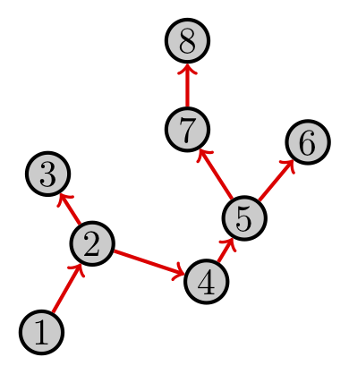

## Why Networks?

---

## Networks

---

## Networks

---

## Networks

Sometimes, instead of data about isolated units (humans, usually) and their attributes/outcomes, we have relational data about the connections between units. 

Networks are _data structures_ for representing relational information.

Some people think networks are transcendental data structures that can reveal many hidden truths about the human condition.  I don't, but I do think networks are very useful.

But there are a lot of pitfalls in analyzing network data.  Many data analysis heuristics and existing statistical tools do not work for network data, and may give misleading results. 

---

## Network notation

Mathematicians call networks _graphs_.  A graph consists of:
- a set $V$ of _vertices_ (nodes, subjects, units, egos)
- a set $E$ of _edges_ (links, arcs, connections, relationships)
       $$ E = \{ \{i,j\} \text{ for } i,j\in V\} $$

   $$V = \{1,2,3,4,5,6,7,8\}$$ 
   $$E = \{ \{1,2\}, 
           \{2,3\}, 
           \{2,4\}, 
           \{2,7\}, 
           \{3,7\}, 
           \{4,5\}, 
           \{5,7\}, 
           \{5,6\}, 
           \{6,8\}, 
           \{7,8\} \}$$

---

## Examples of networks $G=(V,E)$

  Network ($G$) & Vertices ($V$) & Edges ($E$) 

  | Social | people | friendships |
  | ------ | ------ | ----------- |
  | Needle | needles | people  |
  | Publication | articles | citations  |
  | Publication | authors | co-authorship  |
  | Phylogenetic | species | ancestral relationship  |
  | Trade | countries | trade relationships  |
  | Gene expression | genes | interactions  |
  | Brain  | cortical regions | fiber tracts  |
  | Neural | neurons | axons  |
  | Injection | people | needle sharing partners |

Types of networks: directed/undirected

An undirected network has symmetric links

     
A _directed_ network has directed links

 Edges in an undirected graph are usually denoted as _ordered_ pairs, e.g. $E=\{ (i,j):\ i \to j\}$. 

## Types of networks: weighted

   In a _weighted_ network, each edge $\{i,j\}\in E$ has a numeric attribute $z_{ij}$. 

Sometimes we define $z_{ij}=0$ if $\{i,j\}\notin E$. 

## Special types of graphs

 Graphs can be

- empty ($E=\emptyset$)
- complete ($E=\{ \{i,j\} \text{ for all } i,j\in V\}$)
- connected (all vertices are connected to each other via a path)
- acyclic (tree, DAG) 
- planar (no crossing edges)
- sparse (not too many edges)
- dense (lots of edges) 

There are lots of other types of graphs!  

## Terminology: degree

The _degree_ of a vertex is the number of edges incident to it: 
$$d_i = |\{j\in V:\ \{i,j\}\in E\}|$$

 Vertex 7 has degree $d_7=4$.  Sometimes social scientists call this the _egocentric network size_ or just _network size_.

 For directed graphs, we distinguish between 

- _in-degree_ $d^\text{in}_i=|\{j:\ (j,i)\in E\}|$
- _out-degree_ $d^\text{out}_i =|\{j:\ (i,j)\in E\}|$

---

## Degree sequence/distribution

The _degree sequence_ of a graph is the sequence (sometimes ordered) of vertex degrees. 

Degree sequence: $\mathbf{d}=(1,4,2,2,3,2,4,2)$ 
 
Does the degree sequence $\mathbf{d}$ uniquely determine the topology of $G$?

The _degree distribution_ is the frequency of each degree value in a graph. 

---
 
## More terminology

- A network _motif_ is just a pattern of edges for a collection of vertices. 
- A _clique_ is a set of vertices for which the edge set is _complete_.  
- The _giant component_ is the biggest connected component of a graph. 
- _Transitivity_ is the propensity of the graph to exhibit _triangles_. 
- A network with _community structure_ has more links within groups of vertices than between groups. 
- _Small world_ networks have every pair of vertices connected by a short path. 
- The graph _Laplacian_ is $L=D-A$ where $D=\text{diag}(d_1,\ldots,d_n)$ and $A$ is the adjacency matrix.
- The _eigenvalues_ of $A$ or $L$ can tell you about how _connected_ the graph is. 
 
 ---

## Representing networks

Consider a graph $G=(V,E)$.  

_Adjacency matrix_: $A_{ij} = 1$ if and only if $\{i,j\}\in E$.  

- $A_{ij}=A_{ji}$ for an undirected graph, so $A$ is symmetric. 
- $A_{ii} = 0$ for all $i\in V$ if no self-loops.
- The elements of the adjacency matrix might be $A_{ij}=z_{ij}$ in a weighted graph.

---

## Properties of the adjacency matrix

In general, using the adjacency matrix representation of a graph lets you do _linear algebra_. 

Simple properties: 

- $A 1 = \mathbf{d}$ 
- $1'A1 = 2|E|$ (handshake theorem)
- The $i,j$ element of $A^k$ is the number of walks of length $k$ that start at $i$ and end at $j$.  What is $\text{trace}(A^3)/6$?

Spectral properties

- Recall that $\lambda$ is an eigenvalue and $x\neq 0$ is an eigenvector if $Ax=\lambda x$ 
- When $A$ is symmetric, it has $|V|$ real eigenvalues, called the "spectrum" of $G$. 
- Certain useful properties, like connectedness and clustering, can be deduced from the spectrum of $G$. 

## Viewing networks: principles

Visualizing a network requires a _layout algorithm_ that tells your computer where to put each of the vertices relative to each other in two dimensions. 

Layout algorithms try to place vertices in 2 dimensions so that:

- vertices do not overlap
- few edges overlap
- network components are evident
- community structure is evident
- path length corresponds to spatial distance
But, it is _very_ difficult to achieve all these goals simultaneously. 

I recommend:

- Use visualization to gain insight, not to make arguments.
- Start with a circular-by-degree layout. 

---

## One network, many hairballs

 

www.hiveplot.com 

---

## Viewing networks: algorithms and pitfalls

Hu, Lu, Wu, "Spectrum-Based Network Visualization for Topology Analysis", _IEEE Computer Graphics and Applications_ 33, pages 58-68, 2013.

---

## Viewing weighted networks

https://rgriff23.github.io/projects/primate\_networks.html

## Network summaries: centrality

For a vertex $i$, define
- _degree centrality_: $d_i$ 
- _closeness centrality_: 
$$ \frac{1}{\sum_{j\in V} \text{shortestPathDist}(i,j)} $$
- _betweenness centrality_: 
$$ \sum_{j\neq k\neq i} \frac{\#\text{shortestPaths}(j\to i \to k)}{\#\text{shortestPaths}(j\to k)} $$
- _eigenvector centrality_: $x_i$ where 
$$ Ax = \lambda x$$
defines the eigenvector $x$ and its corresponding (largest) eigenvalue $\lambda$. 
There are many other measures of centrality.  

## Network summaries: clustering/community detection

There are two main ways networks are divided into clusters/communities:
- _Hierarchical clustering_ iteratively combines (divides) vertices into sets based on their connectivity.  
- _Spectral clustering_ exploits algebraic (eigendecomposition) properties of the adjacency matrix $A$ or the graph Laplacian $L=D-A$.  

## Vertex and edge attributes

Vertices and edges can have _attributes_, or observations associated with them.  
- Let $x_i$ be attributes of vertex $i\in V$. 
- Let $z_{ij}$ be attributes of the edge $\{i,j\}$. 

We might want to summarize node traits in the network by
- degree assortativity: connections to nodes with similar degree
- trait assortativity (homophily): connections to nodes with similar traits

http://social-dynamics.org/homophily

## Network models

   Why do we need models for networks? 
   Networks are complicated, and there are lots of them.  By constructing models, learn about the structure of a complicated object using a small number of parameters.  

## How many networks?

One reason we need models is that there are _a lot_ of networks:

- Number of undirected graphs on $n$ vertices: $2^{\binom{n}{2}}$ 
- Number of directed graphs on $n$ vertices: $2^{n(n-1)}$

_Example_ For a graph $G=(V,E)$ with $n = |V| = 50$, there are approximately $5.77\times 10^{368}$ possible undirected graphs and $3.34\times 10^{737}$ directed graphs. There are about $10^{80}$ atoms in the known universe. 

This means that it can be prohibitively difficult to enumerate them for even modest $n$. 

So it is helpful to have a model with fewer parameters than $2^{\binom{n}{2}}$ that helps us summarize networks. 

## Network models

A _network model_ is a set of networks $\mathcal{G}$ and a probability function $\Pr(\cdot)\ge 0$ that maps networks to probabilities such that 
$$ \sum_{G\in\mathcal{G}} \Pr(G) = 1.  $$

_Probabilistic network models and parameter estimation_: If you have a probability model $\Pr(\cdot|\theta)$, where $\theta$ is a set of parameters, and you observe a network $G$, you might want to find the value of $\theta$ that maximizes the probability of the network.  In other words, 
$$ \hat\theta = \arg\max_{\theta} \Pr(G|\theta) $$
This is called "maximum likelihood".  

There are many other ways to estimate parameters.  %But the basic idea is to use an observed network $(G,X,Z)$ to tell you something about the model $\Pr(G,X,Z|\theta)$ that might have generated that network. 

## Network model: Erdos-Renyi

Consider a graph of $n=|V|$ vertices in which each edge exists independently with probability $p$.  Then the probability of observing a particular graph $G=(V,E)$ is 
$$ \Pr(G|p) = p^{|E|} (1-p)^{\binom{n}{2} - |E|} $$
Many analytic results can be derived for the ER model:

- $|E| \sim \text{Binomial}\left(\binom{n}{2},p\right)$
- $d_i \sim \text{Binomial}\left(n-1,p\right)$
- Expected degree of a vertex is $\text{E}[d_i] = (n-1)p$
- Expected number of edges $\text{E}[|E|] = \binom{n}{2}p$
- $p=1/2$ gives the \emph{uniform} distribution over graphs, 
     $$ \Pr(G|p=1/2) = 2^{-\binom{n}{2}} $$
     Does $p=1/2$ give the uniform distribution over $|E|$?

Also known as: Bernoulli model, homogeneous random graph

Is the ER model a good model for human social networks?  Does the Erdos-Renyi model produce _community structure_?

## Network model: logistic edge probabilities

A simple model for graph edges, given vertex attributes, is 
$$ \log\left[\frac{\Pr(i \sim j)}{\Pr(i\nsim j)}\right] = \alpha + \beta f(x_i,x_j) $$
where $\alpha$ is an intercept and $f(x_i,x_j)$ is some (symmetric) function:  

- $f(x_i,x_j) = x_i + x_j$ 
- $f(x_i,x_j) = ||x_i - x_j||$ 
- $f(x_i,x_j) = (\epsilon + ||x_i - x_j||)^{-1}$ 

You should use this model to explain the formation of a network if:

- the network was formed _after_ vertex attributes arose
- homophily (or heterophily, or some kind of assortativity) is the only reason that links exist
- edges are conditionally independent given vertex attributes (no global structure)

## Exponential random graph models (ERGMs)

An _exponential random graph model_ (ERGM) has probability
$$ \Pr(G|\theta) = \frac{\exp[\theta'h(G)]}{\kappa(\theta)} $$
where $h(G)$ is some function of $G$ (called the \emph{sufficient statistic}), and 
$$ \kappa(\theta) = \sum_{g\in \mathcal{G}} \exp[\theta'h(g)] $$
is a normalizing constant that ensures these probabilities sum to 1.

Good things: 

- easy to parameterize in low dimension
- can capture complex global topological properties
Bad things: 
- intractable normalizing constant $\kappa(\theta)$
- difficulty fitting 
- degeneracy

## ERGMs

Examples of ERGM sufficient statistics

- $h(G) = |E|$ (Erdos-Renyi)
- $h(G) = ( |E|, \text{\#triangles}$ ) (dyads and triangles)
- $h(G) = (AKS_\lambda, \text{\#triangles})$ (alternating $k$-star statistic) with
         $$ AKS_\lambda(G) = \sum_{k=1}^{n-1} (-1)^k \frac{S_k(G)}{\lambda^{k-2}} $$
         where $S_k(G)$ is the number of $k$-stars in $G$. 
It is _not_ true that every function $h(G)$ yields a valid joint distribution over graphs $\mathcal{G}$. 

---

## ERGMs: fitting

We observe $G$, we want to fit the ERGM $\Pr(G|\theta)$ to learn about $\theta$. 
$$ \ell(\theta) = \log\left[ \Pr(G|\theta)\right] = \theta'h(G) - \log\kappa(\theta) $$
Taking the derivative (gradient) with respect to $\theta$ (and then doing some algebra) yields the estimating equation
$$ \nabla_{\!\theta} \ell(\theta) = h(G) - \text{E}_\theta[h(G)] = 0 $$

This suggests a stochastic algorithm for learning about $\theta$: 

- For a given $\theta$, simulate lots of graphs $G_k\sim \Pr(G|\theta)$: 
       $$ \frac{1}{M} \sum_{k=1}^M h(G_k)  \to \text{E}_\theta[h(G)] $$
- Compute $h(G) - \text{E}_\theta[h(G)]$. 
- Choose another value of $\theta$ to make this difference smaller.
- Repeat

---

## ERGMs: degeneracy

Model degeneracy occurs:

- when a combination of parameters $\theta$ implies that only a small number of graphs have substantial non-zero probabilities; often, these graphs are radically different from each other, for example the empty graph and the fully connected graph;
- when the MLE of $\theta$ does not existent or is hard to obtain, or the MLE of $\theta$ as computed by MCMC methods fails to converge or appears to converge extremely slowly;
- when the estimate of $\theta$ would make the observed network very unlikely.

Rinaldo, Fienberg, Zhou. On the geometry of discrete exponential families with application to exponential random graph models. \emph{Electronic Journal of Statistics} 3 (2009): 446-484.
       
---

## ERGMs: degeneracy example

Let $h(G) = (\text{\#edges}, \text{\#triangles})$.  Let $\Pr(G|\theta) \propto \exp[\theta'h(G)]$.

---

## ERGM degeneracy

Rinaldo, Fienberg, Zhou. On the geometry of discrete exponential families with application to exponential random graph models. _Electronic Journal of Statistics_ 3 (2009): 446-484.

---

## Exchangeable: SBM

Exchangeable graphs have the property that their distribution is invariant to permutation of the vertex labels. 

The stochastic block model (SBM) is a graph in which each vertex $i\in V$ has a categorical attribute $x_i\in\{1,\ldots,K\}$.  The attribute $x_i$ is called the "block" membership of $i$. 

Define a $K\times K$ matrix 
     $$ P = \begin{pmatrix}
       p_{11} & p_{12} & \cdots & p_{1K} \\
       p_{21} & p_{22} & \cdots & p_{2K} \\
       \vdots & \vdots & \ddots & \vdots \\
       p_{K1} & p_{K2} & \cdots & p_{KK} \\
     \end{pmatrix} $$
that defines the edge probabilities between each of the $K$ "blocks". 
     
An edge between $i$ and $j$ is formed with probability $P_{x_i,x_j}$. 

---

## Exchangeable: SBM

See also: degree-corrected SBM. 

---

## Other network models

There are lots of other network models designed to capture important features of real-world networks. 

One of the main features is a "heavy-tailed" degree distribution in which most vertices have small degree, and some have very large degree.  

Further reading:

- Scale-free, power-law, Barab\'asi-Albert, preferential attachment
- Small world, Watts-Strogatz
- Exchangeable (graphon)
- Degree-corrected SBM

---

## Models for processes on networks

Dynamic or stochastic processes on networks are beyond the scope of this talk.  However, you might be interested in further reading on: 

- Random walks on networks, and their equilibrium distributions
- Markov random fields as coherent models for vertex outcomes 
- Clifford-Hammersley theorem, Brooks' Lemma for existence of valid joint distributions on vertex outcomes
- Diffusions, cascades
- Epidemics on networks
- (Economic) Games on networks, equilibria

---

## Analysis: first steps

First, think about the data.  For example: 

- How was the network collected?
- Are any nodes/edges missing/unobserved?
- Are any node/edge attributes missing?
- How did the network form?
- Is the network static in time, or dynamic?
- How did the attributes arise: all at once, or over time?

Next, 

- Compute some summaries: attribute means, standard deviations, histograms
- Compute assortativity with respect to degree and other attributes
- Compute topological summaries: degree distribution, density, triangles
- Visualize the network in several different ways

---

## Analysis pitfalls: network sub-samples

Beware the sub-sampled network!

Suppose $G=(V,E)$ is a graph from a graph model $\Pr(G)$. Suppose you obtain a randomly chosen vertex subset $V_S\subset V$.  You observe the _induced subgraph} $G_S=(V_S,E_S)$, where $\{i,j\}\in E_S$ if and only if $i,j\in V_S$ and $\{i,j\}\in E$. 

Then in general $G_S$ does _not} follow the graph model $\Pr(G)$. 

So, _you cannot generalize findings from $G_S$ to $G$_. In particular, sub-samples destroy triangles and other higher-order structure, so inferences about the topology of $G_S$ are not representative of the topology of $G$. 
  
Exception: exchangeable models like ER and SBM.
  
See also: Chapter 5 of Kolaczyk, Statistical Analysis of Network Data. 
  
---

## Analysis pitfalls: causation, homophily, contagion

Suppose vertex attributes have an effect on both edge existence and vertex outcome.  _Then conditioning on the network $A$ induces non-causal association between attributes and outcomes_.

This is also called "collider" or "selection"" bias.  Be extra careful about ascribing a causal interpretation to "spillover" estimates in networks. 

---

## Auto-logistic model for binary outcomes

The standard network regression for a binary vertex outcome $y_i$ is usually:
$$ \log\left(\frac{\Pr(Y_i=1)}{\Pr(Y_i=0)}\right) = \alpha + x_i'\beta + \frac{\gamma}{|N_i|} \sum_{j\in N_i} y_j $$

where $\alpha$ (intercept); $\beta$ (individual effect); $N_i$ (neighbors of $i$); $\gamma$ (peer/spillover effect) 

You can use it if you agree with all of these statements:

- The outcomes $y_i$ were realized simultaneously
- Yet, before realizing their outcome, $i$ looked to see what their neighbors were up to
- $i$ only cares about the proportion, not the number, of her neighbors who have positive outcome 

Estimating $\gamma\neq 0$ does _not_ imply contagion, spillover, or "peer effects". 

---

## Auto-normal linear model

Consider the linear model for the mean outcome
$$ \text{E}[Y_i] = \alpha + \beta'x_i + \frac{\gamma}{|N_i|} \sum_{j\in N_i} (y_j-\alpha-\beta'x_j) $$
with 
$$ \text{Var}[Y_i] = \sigma^2 $$
This defines a Normal (Gaussian) linear model.  It produces a Markov random field and yields a valid joint distribution. 

Estimating $\gamma\neq 0$ does _not_ imply contagion, spillover, or "peer effects". 

## Network regression

General advice:

- Don't use vertex degree (or any topological feature) as a covariate in a regression, unless you believe the network does not induce dependence, and degree-exchangeability holds [Hint: it doesn't]. 
- Instead, use a measure of "network exposure" in regression models for vertex outcomes. 
- If you must use alters' outcomes on the right-hand side of a regression equation, use the auto-normal or auto-logistic model.  This results in a valid joint distribution (a Markov random field)
- If you invent your own conditional mean model $\text{E}[Y_i]$ as a function of alters' $Y_j$'s, use caution: you might be specifying a model for which no valid joint distribution exists. 

## Analysis pitfalls: bootstrap standard errors

When subjects are independent, researchers sometimes _resample} outcomes and compute the distribution of an estimator under resampling.  
   
_Bootstrap standard errors} for independent units that do not depend on asymptotic normality can be computed in this way. 

Suppose you have a statistic (estimator) $T(G)$.  

Q: Can you resample vertices in $G$ to get valid bootstrap standard errors? 
A: Basically never.  

However, some classes of random graph model (exchangeable) have a distribution that is invariant to sampling subgraphs.  

## Principles of network data analysis

In no particular order: 

- Sample size is probably $n=1$, and definitely not $n=|V|$.
- Don't sub-sample networks, unless you're following Ch 5 of Kolaczyk
- Beware treating alters' outcomes as ego's predictors.
- Take the passage of time seriously in analyses of contagion.
- Report meaningful summaries. 

## Resources

*books*

- Eric D. Kolaczyk Statistical Analysis of Network Data 
- Mark E. J. Newman Networks: An Introduction 
- Matthew O. Jackson Social and Economic Networks 

---

[[Back: Agent-based Models]](../agent/agent.html)
[[Home]](../index.html)
[[Next: Network models]](../network/network.html)

---

## References 

